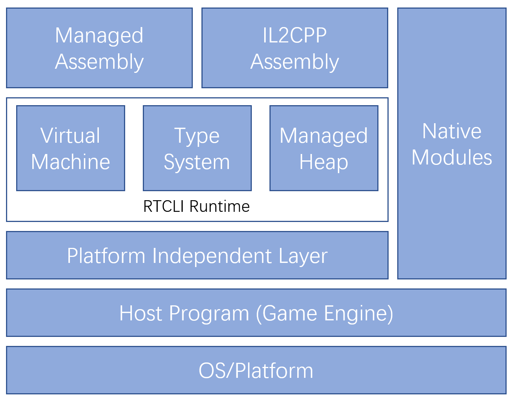

# RTCLI


This repository hosts the source code of RTCLI Runtime.

**RTCLI (Real-Time Common Language Infrastructure)** is an implementation of the [Common Language Infrastructure](https://docs.microsoft.com/en-us/dotnet/standard/clr). Unlike other versions of CLI like .Net, .Net Core or Mono, the RTCLI is specifically designed for real-time applications like Games, Interactive Media Apps and Data Visualization Apps, where high performance, minimal memory footprint, low responding time is expected.

RTCLI can run MSIL/CIL codes that conform to [ECMA-335](https://www.ecma-international.org/publications/standards/Ecma-335.htm) standard, you can use any language compiler that conforms to ECMA-335 to compile C#, F# or VB.Net codes into MSIL/CIL assemblies that can be loaded by RTCLI. RTCLI is written in pure C++, and is designed to be easy to embed into a host C++ program like an in-house Game Engine as the scripting engine. RTCLI is portable to almost any platforms and CPU architectures that we already know, we removed the JIT compiler of the CLI from RTCLI (see explanations below) so there is no CPU-specific codes included in the source code. We hope the RTCLI can be the best choice on the market when you want to embed a C# scripting environment into your Game Engine.

Key features:

* Self-contained and easy to embed into your Game Engine.
* Cross platform.
* Clean and well-documented APIs.
* Easy to integrate with C++ codes.
* VM and IL2CPP code generation support.
* The RTGC algorithm specially designed for real-time applications to reduce frame peak impact.
* Hot-patching support.
* High performance (close to pure C++ in release mode), low memory footprint.

## RTCLI Runtime Architecture

The following diagram illustrates the RTCLI architecture:



### Host Program Integration

RTCLI Runtime is designed to be embedded into your host program, so in most cases you will have an existing framework like a Game Engine that you want to add the scripting support to. The RTCLI itself is platform and host program agnostic, it knows nothing about the underlying environment. All functionalities the RTCLI needs are exposed to RTCLI by one set of interfaces that we call **Platform Independent Layer** or **PIL**. PIL is represented by one set of C++ functions that the host program should implement, when the RTCLI needs to use OS/Platform services like memory allocation, file I/O, time querying, etc. , it calls the corresponding functions in PIL (implemented by the host) rather than calling the system API directly, this allows the host program to fully monitor all requests issued from the RTCLI.

### RTCLI Runtime

The RTCLI Runtime can be roughly divided into the following three components:

* The Virtual Machine

  The virtual machine (or simply VM) is used to execute the MSIL/CIL in interpreted mode. When one CIL method is provided to the virtual machine, the virtual machine uses built-in JIT translator to translate the CIL into the internal bytecode format that is suitable for executing in VM. The bytecode is then cached and provided to the VM for execution.

  > Why we decided to remove the traditional JIT compiler and prevent the CIL from compiled to native CPU instructions? There are 2 main reason for that: Firstly, the JIT compiler will generate CPU instructions at runtime, which means that we need to acquire execute permissions for the memory pages we use to store the compiled machine code. This is unsafe and usually unfeasible because **most game console OSs and the iOS banned machine code generation at runtime**, while interpreted bytecode does not suffer from this. Secondly, JIT compiler is tightly coupled to the specific OS and CPU, which means that we need to maintain one JIT compiler variant for each combination of OS & CPU. That will bloat the code base we need to maintain and is actually very hard to do correctly.

* Type System

  The type system (formally called the Common Type System or CTS) is used to store all metadata the assembly carries, which makes the code "managed". When the Assembly (the dll or exe file that contains CIL and metadata) is loaded, all metadata the Assembly carries will be poured into the CTS to be used by the VM or by the user. The Type System in RTCLI supports one useful feature called hot-patching or hot-reloading, which means adding, changing or removing the metadata or CIL code on the fly without restarting the program and losing the program context. The hot-patching facilities will be described below.

  The type system supports type registration and manipulation from both CLI or C++ side. The CLI side is to parse the metadata in the Assembly to fetch the type information, while the C++ side is to register new CLI types using C++ code. The later is mainly used by C++ modules generated by IL2CPP.

* Managed Heap

  The Managed Heap is used to store all dynamic variable data in the application like the global/static variable, the threads' calling stacks and all data that is created during the runtime. When we talk about "creating a new instance of XXX", we are talking about manipulating the Managed Heap.

  Like other CLI implementations, memories in the Managed Heap are managed automatically by the Garbage Collector. Unlike other CLI implementations, we uses our own GC algorithm that we call Run-Time GC (RTGC) that consume a predictable and controllable time in every ***frame*** to minimize the impact of frame peak (one random frame consumes significantly more time than other frames because the stop-the-world GC is triggered).

### Managed Assemblies and Native(IL2CPP) Assemblies

An Assembly in CLI is an independent, self-contained module that can be loaded into the CLI as a whole part. When stored on the disk, an Assembly is represented as one .DLL or .EXE file with normal PE/COFF format. Every Assembly contains the Assembly manifest, the metadata segment and/or the MSIL/CIL segment, see [Microsoft Docs for .Net](https://docs.microsoft.com/en-us/dotnet/standard/assembly/) for details about Assembly and Assembly file.

The RTCLI provided two ways of using assemblies:

1. Load the Assemblies directly and execute it in interpreted mode.
2. Use IL2CPP to translate the Assemblies to C++ files, then compile the C++ file to native C++ modules, and load the C++ modules using the Native Interface of the RTCLI

If the Assembly is loaded using the first method, then we call it the **Managed Assembly**; if the Assembly is loaded using the second method, then we call it the **Native Assembly** (or sometimes **IL2CPP Assembly** in order not to confuse with the **Native Modules** we're going to talk). There are no differences between the Managed Assembly and Native Assembly when running, they all uses the same CTS, the same VM (the VM calls methods in Native Assembly just like calling regular C++ functions), and they can call each other seamlessly without any extra cost.

> The differentiation of the Managed Assembly and Native Assembly is mainly for developing purposes: Managed Assemblies compiles much faster than Native Assemblies, and is easier for hot-patching, so it is better to load the Assembly in interpreted mode when iterating the Application code. In contrast, Native Assemblies runs faster and is harder to disassemble, which makes it suitable for releasing. You can even builds the Native Assembly as static library and pack it into the final executable file, so that it behaves almost the same as the native C++ module.

### Native Modules and RTCLI Native Interface

**Native Modules** refers to the modules that have nothing related to the CLI. They are modules written purely in C++ and maybe exists before the CLI is introduced to the host program. **Native Modules** is different from **Native Assemblies**, the later is translated from Assembly by IL2CPP translator.

Native Modules interacts with RTCLI by a special set of C++ functions called **RTCLI Native Interface**, or simply **Native Interface**. With Native Interface, the Native Module can:

2. Initializes and closes CLI.
3. Loads, unloads and reloads Assembly file/data.
4. Creates and registers runtime-generated Assembly, which means:
   1. Generate CLI types by C++ code.
   2. Generate MSIL/CIL codes for CLI methods by C++ code.
   3. Expose C++ functions to CLI as native methods to be called by the Managed Code.
5. Call CLI managed methods from C++.
6. Controls the behavior of the CLI.

In fact, when one Assembly is translated into IL2CPP Assembly, it also utilizes the Native Interface to register all its metadata to the CLI by describing and registering a runtime-generated Assembly, as described in (3). All methods in Native Assembly is compiled into C++ functions, and they will be called by CLI just like any normal C++ functions.

## System Process Flow

The RTCLI works frame-to-frame, it is designed to be used in real-time environments, where the application have an update loop like this:

```c++
void run_app()
{
	app_init();
	
	while(!app_is_exiting())
	{
		app_begin_frame();
		// Updates every subsystem's state here.
		app_update();
		app_end_frame();
	}
	
	app_shutdown();
}
```

The real-time means the system and most of its subsystems should update and respond to the user in a regular (usually fixed and limited) time basis. The typical case for a real-time system is the video games, in which the game state and the screen is updated usually 60 times per second to create fluent experience. If the requirement for real-time is violated (for example, the screen only updates 5 times per second, or one update takes several seconds), then the user experience will be disrupted and the system even may be instable. The contrast of real-time application is the event-driven application, in which the application never wakes until something happened, and there is no frame concept in such application.

After the RTCLI is embedded, the system update loop should look like this:

```c++
void run_app()
{
	app_init();
    // Initializes the RTCLI Runtime.
    rtcli::init();

	while(!app_is_exiting())
	{
		app_begin_frame();
		// Updates every subsystem's state here.
		app_update();
        // Run scripts.
        rtcli::call("MyClass", "MyMethod");
        
        /* If needed, waiting all scripts to be finished here. */
        
        // Updates the RTCLI.
        rtcli::frame();
		app_end_frame();
	}
    
    // Closes the RTCLI runtime.
    rtcli::close();
	app_shutdown();
}
```

There are two execution modes in RTCLI: the **user mode** and the **kernel mode**. The kernel mode starts when the user calls `rtcli::frame()`, and ends after `rtcli::frame()`returns, at any other time, the user mode is applied.

**In the kernel mode, the context is stopped for maintenance by CLI, so any thread cannot call scripts during the kernel mode, and all running scripts should finish and return to C++ context before calling `rtcli::frame()`. This is an extra limitation we set for RTCLI.** At the end of each frame, RTCLI performs the following operations:

1. Checks if any metadata is updated and hot-reloading is needed.
2. Running Real-Time Garbage Collecting Algorithm (RTGC).